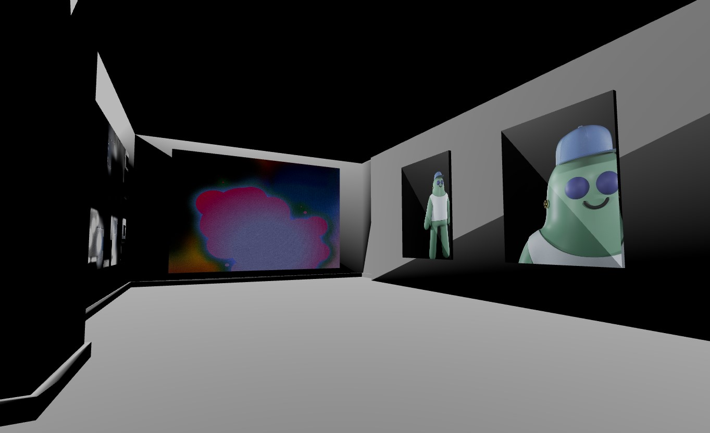

# Gallery Demo

**This is an immersive demo of a 3D art gallery.**  
(click on the image below to visit the live demo site)
[](https://6-gallery-demo.vce.oneclickwebapps.com/)

#### Player Control Options:
* VR Headset + controllers
* Browser window + keyboard & mouse 


#### Tech used in this project:

[**`Next.js`**](https://github.com/vercel/next.js/): A React framework that enables several extra features, including server-side rendering and generating static websites.  
[**`Three.js`**](https://threejs.org/): A lightweight, 3D library with a default WebGL renderer. The library also provides Canvas 2D, SVG and CSS3D renderers in the examples.  
[**`react-three-fiber`**](https://github.com/pmndrs/react-three-fiber): A React renderer for Threejs on the web and react-native.  
[**`react-xr`**](https://github.com/pmndrs/react-xr): React components and hooks for creating VR/AR applications with react-three-fiber.  
[**`use-cannon`**](https://github.com/pmndrs/use-cannon): React hooks for [cannon-es](https://github.com/pmndrs/cannon-es). Use this in combination with react-three-fiber.  
[**`drei`**](https://github.com/pmndrs/drei): A growing collection of useful helpers and abstractions for react-three-fiber.
  
---
## Run Locally

Clone the project

```bash
  git clone https://github.com/NextStax/gallery-demo.git
```

Go to the project directory

```bash
  cd gallery-demo
```

Install dependencies

```bash
  yarn
# or
  npm install
```

---
### For HTTPS - *required for standalone VR*
Make and go to the certificates folder

```bash
  mkdir certificates
  cd certificates
```

Generate Self signed certification for local https development
```bash
openssl req -x509 -newkey rsa:4096 -keyout key.pem -out cert.pem -days 365
```
follow the prompts.

---
### For HTTP - *PCVR only (webxr allows http on localhost)*

Change package.json scripts from,

```
"scripts": {
    "dev": "nodemon server.js",
    ...
}
```
to 
```
"scripts": {
    "dev": "next dev",
    ...
}
```

---

### Start the dev server

```bash
  yarn dev
# or
  npm run dev
```

### Go to https://localhost:3000
or http://localhost:3000 if opting for HTTP

---

## Authors
- [Kenny Stanley](https://www.github.com/KennyStanley)


## 3D Artists
- [Adrian Baqueiro](https://www.linkedin.com/in/adrianaragonbaqueiro)
- [Cordelia Garcia]()